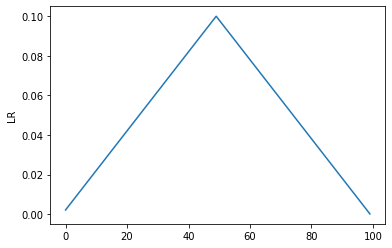

```python
import torch
import torch.optim as optim
import matplotlib.pyplot as plt
from torchvision import models
import numpy as np

def get_learning_rate(optimizer):
    lr=[]
    for param_group in optimizer.param_groups:
       lr +=[ param_group['lr'] ]
    return lr

def plot_lr(data):
    plt.plot(data)
    plt.ylabel('LR')
    plt.show()

def get_lr_rate(scheduler, optimizer, epochs):
    lr = []
    for epoch in range(epochs):
        scheduler.step()
        lr.append(get_learning_rate(optimizer)[0])
    return lr

model = models.squeezenet1_0()

optimizer = torch.optim.SGD(
  model.parameters(),
  0.1,
  momentum=0.9,
  weight_decay=3e-4
  )

baseLR = 0.0001
maxLR  =   0.1
epochs  = 100
batch  = 128
iterations = epochs * batch
step_size = 50
```


```python
scheduler = torch.optim.lr_scheduler.CosineAnnealingLR(optimizer, epochs)

lr_lists = get_lr_rate(scheduler, optimizer, epochs)

plot_lr(lr_lists)
```


```python
optimizer = torch.optim.SGD(
  model.parameters(),
  0.1,
  momentum=0.9,
  weight_decay=3e-4
  )

scheduler = torch.optim.lr_scheduler.CyclicLR(optimizer, base_lr = baseLR, max_lr = maxLR, step_size_up = step_size)

lr_lists = get_lr_rate(scheduler, optimizer, epochs)

plot_lr(lr_lists)
```





```python

```
